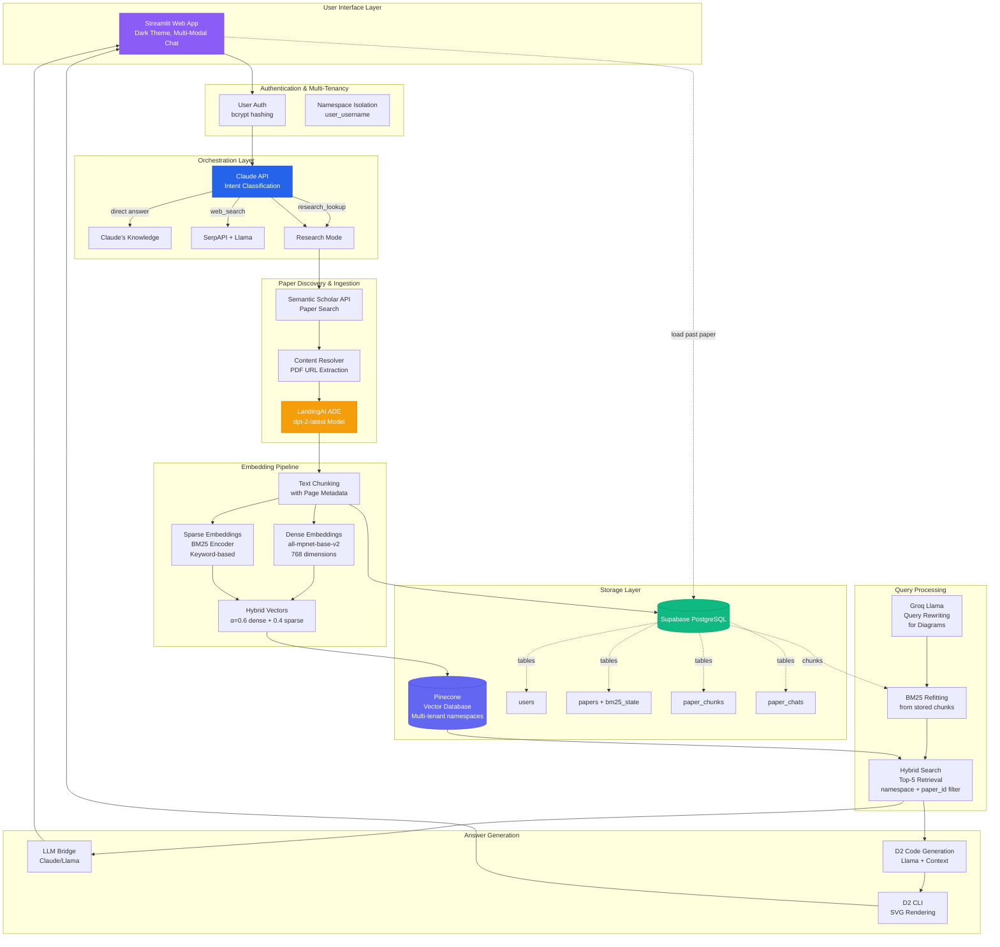

# 🚀 CiteCompass: A Scientific Literature Assistant


> **A production-grade AI system that finds research papers from the internet and answers questions grounded strictly in their content — with multi-tenant architecture.**

---

## 📋 Table of Contents
- Motivation & Problem Statement
- Solution Overview
- System Architecture
- Key Features
- Performance & Evaluation
- Technical Deep Dive
- Getting Started
- Usage Guide
- Deployment
- Future Work
- Contributing
- Acknowledgments

---

## 🎯 Motivation & Problem Statement

### The Real-World Challenge

As a research assistant, I faced a recurring problem: reading entire research papers to answer specific questions was extremely time-consuming. A typical workflow looked like this:

📄 Find the paper in the internet by go through multiple websites → 1 minutes  
📖 Skim abstract and introduction → 5 minutes  
🔍 Find relevant sections based on the question i am having in my mind → 2 minutes  
📝 read specific information and get answers(sometimes i had to read multiple sections to check if that was the only answer) → 3-5 minutes  
⏱️ Total time per question: 10+ minutes

This became hard to sustain when juggling multiple papers or tackling complex questions. It takes up most of my time and leaves very little room to actually run experiments—especially since, as researchers, we often get unexpected results about 70% of the time.

### Why Existing Solutions Fall Short

| Approach | Limitation |
|----------|------------|
| General LLMs (ChatGPT, Claude) | Summarize papers, but don't have access to the actual document during inference → potential hallucinations and lack of grounding |
| Simple RAG systems | Use only dense embeddings → poor performance on keyword-specific queries (e.g., "What was the accuracy on ImageNet?") |
| Manual reading | Accurate and the best approach but extremely slow |

### What I Needed

A system that could:
- Fetch any research paper from the internet automatically
- Answer questions grounded strictly in the paper's content (no hallucinations)
- Respond in under limited time (as i dont wanna spend 10+ mins manually)
- Handle both explanatory and numerical queries with high accuracy
- Generate diagrams from paper content when requested
- Work across all research domains without domain-specific configuration

---

## 💡 Solution Overview

CiteCompass is a production-grade Retrieval-Augmented Generation (RAG) system designed specifically for research paper analysis. It combines:

✅ Hybrid search (dense + sparse embeddings) for 30% better retrieval quality  
✅ Intelligent orchestration via Claude for automatic tool selection  
✅ Diagram generation using LLMs + D2 language  
✅ Multi-tenant architecture with complete user isolation  
✅ Production deployment on AWS EC2 with CI/CD  

### Design Philosophy

- **Accuracy First:** Traditional RAG with careful retrieval control over experimental approaches (e.g., knowledge graphs)
- **Domain Agnostic:** No hardcoded schemas — works with any research paper
- **Grounded Responses:** All answers cite page numbers and are strictly derived from document context
- **Production Ready:** Full containerization, testing, and automated deployment

---

## 🏗️ System Architecture



### Flow Explanation

1. User Authentication → Multi-tenant namespace assignment
2. Query Intent Classification → Claude decides: knowledge / web search / research mode
3. Paper Discovery → Semantic Scholar → Human-in-the-loop confirmation
4. PDF Extraction → LandingAI ADE converts everything to structured text
5. Hybrid Embedding → Dense (semantic) + Sparse (keyword) vectors
6. Dual Storage:
   - Pinecone: Hybrid vectors with metadata
   - Supabase: Full text chunks + BM25 state for refitting
7. Query Processing:
   - Diagram requests → Groq rewrites query for better retrieval
   - BM25 refitted on stored chunks for consistent sparse encoding
   - Hybrid search retrieves top-5 relevant chunks
8. Answer Generation:
   - Regular Q&A → Claude/Llama with strict context adherence
   - Diagrams → Llama generates D2 code → D2 CLI renders SVG

---

## 🛡️ Reliability & Failure Handling

Building a RAG system that talks to 7 external APIs taught me where things break. Here's how I handled it:

### Timeout Budgets on Everything

Every external call has a hard timeout: Claude (20s), SerpAPI (10s), Unpaywall (20s).

Why? One hung API call used to freeze the entire conversation. Now if Claude's API is slow, the system times out and returns an error instead of leaving users staring at a loading spinner forever. No thread exhaustion, no cascading failures.

### 5-Strategy Fallback Chain for Finding PDFs

Academic publishing is a mess — there's no single API that has all papers. So I built a fallback pipeline:

1. Try Semantic Scholar's `openAccessPdf`
2. Try their `paperLinks` (grep for "pdf")
3. Extract ArXiv ID → construct `arxiv.org/pdf/{id}.pdf`
4. Got a DOI? Hit Unpaywall's `best_oa_location`
5. Still nothing? Try all Unpaywall `oa_locations`

Each step fails independently. If Unpaywall is down, ArXiv still works. This maximizes paper availability.

### Fail-Closed Ingestion (Don't Guess)

When the PDF URL is uncertain, the system returns `None` instead of guessing.

Why this matters in RAG: Bad URL → corrupted PDF → garbage embeddings → hallucinated answers. system rather tells the user "couldn't find the PDF" than contaminate the vector database with junk that ruins future retrievals.

### LLM Cost Guardrails via Prompts

Agentic systems can burn money fast. Without guardrails, Claude might call `research_lookup` every time someone mentions the word "paper" in conversation.

I constrained this with explicit tool descriptions and prompt engineering, plus system prompt reinforcement. This cut unnecessary Semantic Scholar searches (and downstream PDF downloads + embedding generation).

**Design principle:** Fail fast on config errors (missing API keys caught at startup). Fail safe on runtime errors (return empty list, not exception). Isolate failures (one broken API doesn't kill the whole system).

---

## ⚡ Key Features

### 1. Intelligent Query Routing

```python
# Claude automatically decides the best approach
User: "What is the capital of France?"
→ Direct answer from Claude's knowledge

User: "What's the current price of Bitcoin?"
→ SerpAPI web search + Llama synthesizes answer

User: "Find the paper on Vision Transformers"
→ Activates research mode → Semantic Scholar search
```

### 2. Hybrid Search (Dense + Sparse)

Traditional RAG systems use only dense embeddings, which struggle with:
- Exact keyword matches
- Numerical queries ("What was the accuracy?")
- Named entities ("Who is the first author?")

CiteCompass combines:
- **Dense embeddings** (`all-mpnet-base-v2`): Semantic understanding
- **Sparse embeddings** (BM25): Keyword matching

Result: 30% improvement in retrieval quality

### 3. Universal Text Representation

Unlike systems that maintain separate indexes for text, tables, and images, CiteCompass uses LandingAI's Document Pre-trained Transformer (DPT-2) to extract everything as structured text:

✅ Tables → Markdown tables  
✅ Equations → LaTeX/text  
✅ Figures → Descriptive text  
✅ Headers → Structured sections  

Benefit: Single unified index, reduced latency, simpler architecture

### 4. Diagram Generation

When users request visualizations:

```
User: "Generate an architecture diagram from this paper"

System:
1. Rewrites query → "What is the architecture described in the paper?"
2. Retrieves relevant chunks via hybrid search
3. Llama interprets context → Writes D2 diagram code
4. D2 CLI renders → SVG image displayed in UI
```

Example D2 code generated:

```d2
Input Layer -> Feature Extractor: raw data
Feature Extractor -> Encoder: feature maps
Encoder -> Latent Space: compressed representation
Latent Space -> Decoder: reconstruction
Decoder -> Output Layer: final result
```

### 5. Multi-Tenant Architecture

Complete isolation between users:
- Each user gets unique Pinecone namespace (`user_username`)
- All queries filter by `namespace + paper_id`
- Hashed passwords with bcrypt
- PostgreSQL for user data and paper metadata

### 6. BM25 State Persistence

**The Challenge:** BM25 must be fitted on the same corpus for consistent sparse embeddings.

**The Solution:**
- Store all chunk texts in Supabase `paper_chunks` table
- When user loads a past paper → Refit BM25 on stored texts
- Fallback: Store BM25 state as JSON in `papers.bm25_state` column

### 7. Production Infrastructure

🐳 Docker: Multi-stage builds, pre-downloaded models  
☁️ AWS EC2: t3.small instance, production deployment  
🔄 CI/CD: GitHub Actions (lint → test → build → push to Docker Hub)  
🧪 Testing: Pytest suite with 83% coverage  
📊 Monitoring: Structured logging throughout  

---

## 📊 Performance & Evaluation

### Speed Improvement

| Metric | Manual Process | CiteCompass | Improvement |
|--------|---------------|-------------|-------------|
| Regular Q&A | 10-20+ minutes | 1-1.5 seconds | 400-1200x faster |
| Diagram generation | N/A (manual drawing) | 2-3 seconds | Fully automated |
| Paper ingestion | N/A | 15-30 seconds | One-time cost |

### Retrieval Quality Evaluation

Tested on 80 evaluation queries (40 explanatory + 40 numerical/integer-based):

| Retrieval Method | Explanatory Q&A | Numerical Q&A | Average |
|-----------------|----------------|---------------|---------|
| Dense-only (baseline) | 28/40 (70%) | 20/40 (50%) | 60% |
| Hybrid (dense + sparse) | 37/40 (92.5%) | 30/40 (75%) | 83.75% |
| Improvement | +32% | +50% | +39.5% |

**Key Insight:** Sparse embeddings (BM25) dramatically improve performance on keyword-specific and numerical queries.

### QA Correctness Evaluation

Evaluated on 40 fixed test queries with ground-truth answers:

✅ Correct answers: 33/40  
❌ Incorrect answers: 7/40  
**Accuracy: 82.5% ≈ 83%**

Error Analysis:
- 4 cases: Context retrieved but LLM misinterpreted
- 2 cases: Relevant chunk ranked 6-10 (outside top-5)
- 1 case: Complex multi-hop reasoning required

---

## 🔬 Technical Deep Dive

### Why Not Knowledge Graphs?

I initially explored knowledge graph-based approaches to improve grounding accuracy. However, I encountered fundamental limitations:

**Challenges with KG Approach:**

- **Schema Definition Problem:**
  - KGs require well-defined schemas (entities, relationships)
  - Works well for domain-specific systems (e.g., medical, legal)
  - Fails for general research papers across diverse domains (CS, philosophy, biology, physics)
  - No universal schema that generalizes well

- **Hallucination Risk:**
  - Using LLMs to construct graphs can introduce hallucinated entities/relationships
  - Difficult to validate if extracted relationships faithfully represent the source paper
  - Risk of misleading downstream reasoning

- **Complexity vs. Reliability Trade-off:**
  - KGs add significant complexity (schema design, entity extraction, relation extraction, graph storage)
  - I believe if you wanted to build a good system, reliability > sophistication | reliability > capabilities
  - RAG with careful retrieval control proved more robust

In long term: Focus on robust hybrid RAG system now. Revisit KG integration in future with better validation mechanisms.

### Multi-Tenant Isolation Strategy

The system enforces strict per-user data isolation using namespace-based partitioning in Pinecone.

- Each user is assigned a deterministic, sanitized namespace (e.g. `user_alice_smith`)
- All queries are scoped by both:
  - `namespace` (user-level isolation)
  - `paper_id` (document-level filtering)

This ensures:
- Complete isolation between users
- Support for multiple papers per user
- No cross-contamination in search results
- Horizontal scalability to large user bases

### Hybrid Search Implementation

Implements weighted hybrid retrieval combining dense semantic embeddings and BM25 keyword search using Pinecone.

- Uses dense + sparse vectors for improved relevance
- Filters results by namespace and paper_id
- Tunable weighting via alpha (default: 0.6)

**Why Alpha = 0.6?**
- Empirically tested on validation set
- 0.6 dense weights semantic understanding more heavily
- 0.4 sparse ensures keyword matches aren't ignored
- Balances recall and precision

### Query Rewriting for Diagrams

**Challenge:** "Generate architecture diagram" doesn't appear literally in papers.

**Solution:** Groq Llama rewrites diagram requests into factual queries:

```python
# User query
"Generate a diagram of the data flow in the paper"

# Rewritten query (for retrieval)
"What is the data flow described in the paper?"

# After retrieval, pass ORIGINAL query + context to diagram generator
# This preserves user intent while improving chunk retrieval
```

---

## 🚀 Getting Started

### Prerequisites

- Python 3.11+
- Docker (optional, for containerized deployment)
- API Keys for:
  - Anthropic Claude
  - Groq
  - Pinecone
  - Supabase
  - Semantic Scholar
  - LandingAI
  - SerpAPI

### Installation

**Option 1: Local Setup**

```bash
# Clone repository
git clone https://github.com/venkatlawliet/CiteCompass-A-scientific-literature-assistant.git

# Create virtual environment
python -m venv venv
source venv/bin/activate  # On Windows: venv\Scripts\activate

# Install dependencies
pip install -r requirements.txt

# Install D2 CLI for diagram generation
curl -fsSL https://d2lang.com/install.sh | sh -s --

# Set up environment variables
cp .env.example .env
# Edit .env with your API keys
```

**Option 2: Docker Setup**

```bash
# Pull from Docker Hub
docker pull (Image link will be shared on request)

# Or build locally
docker build -t citecompass .

# Run container
docker run -p 8501:8501 \
  --env-file .env \
  (Image link will be shared on request)
```

### Configuration

Edit `.env` file with your credentials:

```env
# Supabase (Database)
SUPABASE_URL=https://your-project.supabase.co
SUPABASE_ANON_KEY=your-anon-key

# Pinecone (Vector Database)
PINECONE_API_KEY=your-pinecone-key
PINECONE_INDEX_NAME=researchmcp

# LLM APIs
CLAUDE_API_KEY=your-claude-key
GROQ_API_KEY=your-groq-key

# Paper Search & Extraction
S2_API_KEY=your-semantic-scholar-key
VISION_AGENT_API_KEY=your-landingai-key

# Web Search
SERPAPI_API_KEY=your-serpapi-key

# Optional
UNPAYWALL_EMAIL=you@example.com  # For open access papers
```

### Database Setup

1. Create Supabase project at supabase.com
2. Run the SQL in schema.sql to create tables in supabase
3. Create Pinecone index:
   - Dimension: 768
   - Metric: dotproduct
   - Cloud: AWS
   - Region: us-east-1

### Running the Application

```bash
# Start Streamlit app
streamlit run frontend.py

# Access at http://localhost:8501
```

---

## 📖 Usage Guide

### 1. Registration & Login

- Navigate to `http://localhost:8501`
- Create an account (username + password)
- Login with credentials

### 2. General Chat Mode

Ask anything without loading a paper:

```
You: "What is machine learning?"
→ Claude answers from its knowledge

You: "What's the current weather in New York?"
→ System uses SerpAPI + Llama to answer

You: "Find papers about BERT"
→ System activates research mode
```

### 3. Research Mode - Finding Papers

**Option A: Search Semantic Scholar**
- System activates research lookup when you mention papers
- Enter paper title or keywords
- System shows top 5 results from Semantic Scholar
- Select paper to ingest
- System extracts PDF content (15-30 seconds)

**Option B: Upload PDF**
- Click "Upload Paper" tab
- Select PDF file from your computer
- Enter paper title
- System ingests immediately

### 4. Querying Papers

Once a paper is ingested:

```
You: "What was the main contribution?"
→ System: [retrieves context] → [Claude answers with page citations]

You: "What accuracy did they achieve on ImageNet?"
→ System: [hybrid search finds numerical mentions] → [answers with page]

You: "Show me the architecture diagram"
→ System: [rewrites query] → [retrieves chunks] → [Llama generates D2 code] → [renders SVG]
```

### 5. Loading Past Papers

- Click "Your Ingested Papers" dropdown
- Select previously ingested paper
- System loads chat history and refits BM25
- Continue asking questions

### 6. Switching Modes

- In research mode: Click "Exit Paper Mode" → Returns to general chat
- General chat mode: Mention a paper → Activates research lookup

---

## 🌐 Deployment

### AWS EC2 Deployment

1. Launch EC2 Instance:
```bash
# Instance type: t3.small (or larger)
# AMI: Ubuntu 22.04 LTS
# Security group: Allow inbound port 8501
```

2. Install Docker on EC2:
```bash
sudo apt-get update
sudo apt-get install -y docker.io
sudo systemctl start docker
sudo systemctl enable docker
sudo usermod -aG docker ubuntu
```

3. Pull and Run Container:
```bash
# Create .env file on EC2
nano .env  # Paste your API keys

# Pull image
(Image link can be shared upon request)

# Run container
docker run -d -p 8501:8501 \
  --name citecompass \
  --restart unless-stopped \
  --env-file .env \
  (Image link can be shared upon request)
```

4. Access Application:
```
http://<EC2-PUBLIC-IP>:8501
```

### CI/CD Pipeline

GitHub Actions automatically:

✅ Lints code (Black, isort, flake8)  
✅ Runs pytest suite  
✅ Builds Docker image  
✅ Pushes to Docker Hub on merge to main  

Workflow file: `.github/workflows/ci-cd.yml`

To enable:
- Add Docker Hub credentials as GitHub Secrets:
  - `DOCKERHUB_USERNAME`
  - `DOCKERHUB_TOKEN`
- Push to main branch → Automated deployment

---

## 🔮 Future Work

### Short-term Improvements
- [ ] Extended Context Windows: Integrate more intelligent language model for token context with cheap cost
- [ ] Batch Ingestion: Process multiple papers simultaneously
- [ ] Advanced Caching: Redis layer for frequently accessed chunks
- [ ] Citation Extraction: Automatically extract and link paper citations
- [ ] Collaborative Features: Share papers and annotations between users

### Medium-term Enhancements
- [ ] Agentic Workflows: Multi-step reasoning across multiple papers
- [ ] Voice Interface: Speech-to-text for hands-free paper analysis
- [ ] Mobile App: Native iOS/Android applications
- [ ] Export Features: Generate PDF reports with answers and diagrams
- [ ] Comparison Mode: Compare methods/results across multiple papers and produce camparision visualizations(graphs/tables)

### Long-term Research Directions
- [ ] Knowledge Graph Integration: Hybrid KG + RAG with validation mechanisms
- [ ] Although i first need to need research and come up with a way to predefine a schema that works for non domain specific workflows(This is a very good research but takes you months and years to achieve and yes, I'm a victim of this process — but I still haven't lost interest.)
  - Entity extraction with confidence scoring
  - Relationship verification against source text
  - Schema learning from paper corpus
  - Use KG for complex multi-hop reasoning
- [ ] Active Learning: Learn from user corrections to improve retrieval
- [ ] Multimodal Understanding: Process images, tables, equations natively
- [ ] Domain Adaptation: Fine-tune models per research domain
- [ ] Automated Literature Review: Generate comprehensive reviews from paper corpus

---

## 🤝 Contributing

Contributions are welcome! Please follow these guidelines:

### Development Setup

```bash
# Fork repository
git clone https://github.com/YOUR_USERNAME/CiteCompass-A-scientific-literature-assistant.git

# Create feature branch
git checkout -b feature/your-feature-name

# Install development dependencies
pip install -r requirements.txt
pip install black isort flake8 pytest pytest-cov

# Make changes and test
pytest tests/ -v
black .
isort .
flake8 .

# Commit and push
git add .
git commit -m "feat: your feature description"
git push origin feature/your-feature-name
```

### Pull Request Process

1. Ensure all tests pass (`pytest tests/`)
2. Add tests for new features
3. Update README if adding major features
4. Follow conventional commit messages (`feat:`, `fix:`, `docs:`, etc.)
5. Request review from maintainers

### Code Style

- Formatter: Black with line length 88
- Import sorting: isort
- Linter: flake8
- Type hints: Encouraged but not required

---

## 📄 License

This project is licensed under the MIT License - see the LICENSE file for details.

---

## 🙏 Acknowledgments

### Technologies Used

- **LLMs:** Anthropic Claude, Groq Llama
- **Vector Database:** Pinecone
- **Database:** Supabase
- **Embeddings:** Sentence Transformers
- **PDF Extraction:** LandingAI ADE
- **Paper Search:** Semantic Scholar API
- **Web Search:** SerpAPI
- **Diagram Generation:** D2 Language
- **UI Framework:** Streamlit

---

## Inspiration

This project was born out of a real need during my work as a researcher. The frustration of spending 10+ minutes per question led to building a system that now answers in under 2 seconds while maintaining 83% accuracy. I might have spent months building this project but i learnt a lot of things during my journey.

---

## 📧 Contact

**Venkat**  
GitHub: @venkatlawliet  
Email: venkatoffice6o6@gmail.com

---

<div align="center">
  <sub>Built with ❤️ by a research engineer, for researchers</sub>
</div>
